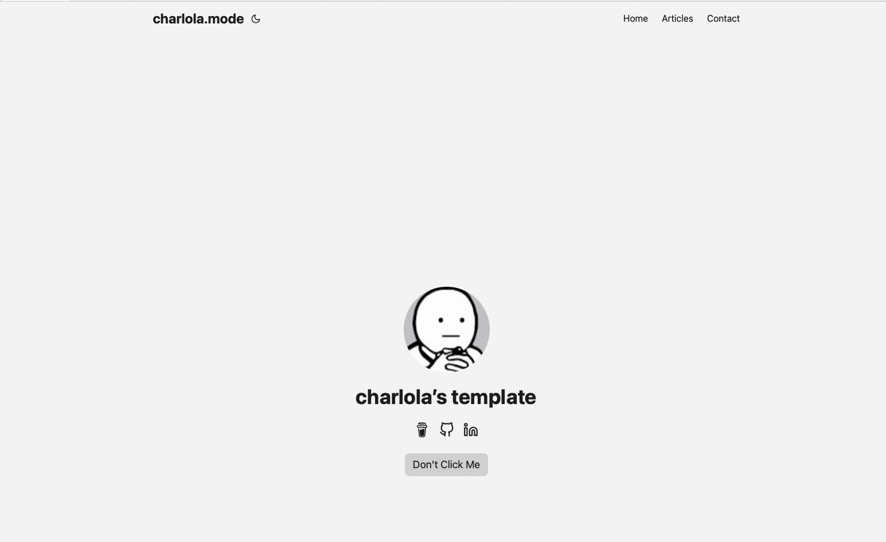

This is a blog template based on the Hugo framework and on this [theme](https://github.com/nanxiaobei/hugo-paper)
It's quick and easy to use with the most minimal and basic functions.



## Quick Start

1. Install [Hugo](https://gohugo.io/installation/)
2. Install [Git](https://git-scm.com/book/en/v2/Getting-Started-Installing-Git)


**Open your terminal or command line**

1. Create a new folder 'my-personal-blog'

```console
mkdir 'my-personal-blog'
```

2. Go into this folder 
```console
cd 'my-personal-blog'
```

3. Initialize an empty Git repository in the current directory
```console
git init
```

4. Clone this repository into your folder
```console
git clone 'https://github.com/charlola/blog-template.git'
```

5. Start Hugo's development server to view the site locally.
```console
hugo server
```


## Open Visual Studio Code to edit your Blog

3. Open your favorite Editor like [Visual Studio Code](https://code.visualstudio.com/download)
### Basic Configuration

The config.yml is your best friend. You can modify and add information, such as ...
- Title of the page
- Your Name
- Social Icons
- Buttons


### Change Profilpic

To add your profilpic, replace ***profil.png*** in the folder ***static/images***. Make sure you take an image with a happy face :)

### Add tabs

In the config.yml you can add new tabs next to 'Articles' and 'Contact. Uncomment 'Category' to check it out.

***Note***
If you add a new tab, you have to do the following:
1. Add new folder in 'content' with the ***same name*** as the new tab.
2. Copy ***_index.md*** from articles into new folder.

### Add new content

If you like to push new content, create a new Markdown file. Find an example in ***content/articles/article.md.

## Thank you!

I'd love to get feedback. Send a message via LinkedIn. Feel free to support this page with a [coffee donation](https://ko-fi.com/heycharlola) :)


## Online Website

To push your website online, use Azure Static Web or Netflify. I used Azure Static Web.
